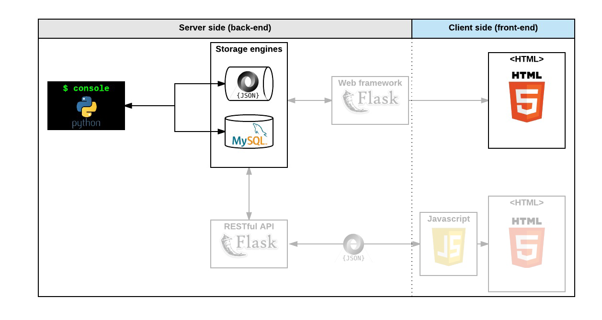

 <h1>AirBnB clone - MySQL</h1> 

This repository contains the second stage of a student project to build a clone of the AirBnB website. In this stage we are implementing MySQL storage in order to store our data in databases and change it from the previous file storage. Thus we will create a layer of storage abstraction done by the`storage.all()`.

To implement the abstraction we will create a database storage that has the same methods as the file storage but it will store in the database.

---

<h3>Environment variables that will be your best friend in this project</h3> 

`HBNB_ENV` :running environment. It can be "dev" or "test" for the moment ("production" soon!)

`HBNB_MYSQL_USER` :the username of your MySQL

`HBNB_MYSQL_PWD` :the password of your MySQL

`HBNB_MYSQL_HOST` :the hostname of your MySQL

`HBNB_MYSQL_DB` :the database name of your MySQL

`HBNB_TYPE_STORAGE` :the type of storage used. It can be "file" (using `FileStorage`) or `db` (using `DBStorage`)
